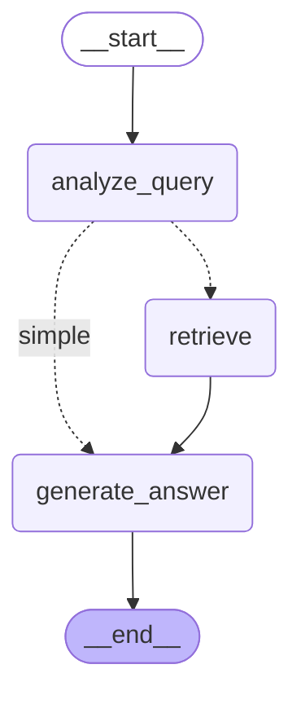
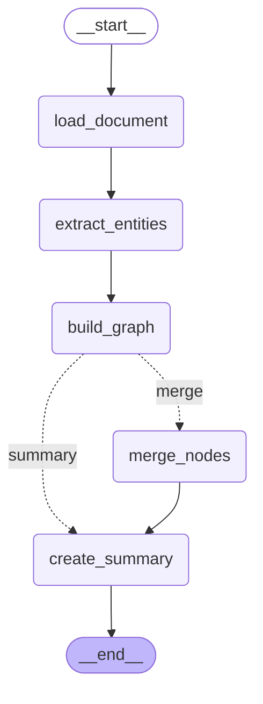

# TASK-009 完成报告：LangGraph 工作流可视化功能

## 任务概述

为 LangGraph 工作流添加可视化功能，生成 Mermaid 格式的工作流图。

## 完成时间

2026-01-11

## 交付成果

### 1. 核心模块 ✅

**文件:** `/Users/skyfu/Projects/AntigravityProjects/Medical-Graph-RAG/src/agents/visualization.py`

实现了以下核心功能：

#### 1.1 基础函数

- `get_graph_mermaid()` - 获取工作流的 Mermaid 格式图表
- `save_graph_mermaid()` - 保存工作流图为 Mermaid 文件
- `print_graph()` - 打印工作流结构到控制台

#### 1.2 高级函数

- `visualize_workflow()` - 统一的可视化接口，支持多种格式
- `generate_html_viewer()` - 生成可在浏览器中查看的 HTML 文件
- `generate_dot_format()` - 导出 GraphViz DOT 格式
- `compare_workflows()` - 比较多个工作流的结构

#### 1.3 辅助函数

- `_generate_ascii_graph()` - 生成 ASCII 艺术表示
- `_generate_json_graph()` - 生成结构化 JSON 格式
- `_mermaid_to_dot()` - Mermaid 到 DOT 格式转换

### 2. 测试脚本 ✅

**文件:** `/Users/skyfu/Projects/AntigravityProjects/Medical-Graph-RAG/tests/test_visualization_standalone.py`

完整的测试套件，包括：

- 创建简单工作流用于测试
- 测试所有可视化函数
- 生成示例输出文件
- 验证功能正确性

**测试结果:** ✅ 所有测试通过

### 3. 文档 ✅

**文件:** `/Users/skyfu/Projects/AntigravityProjects/Medical-Graph-RAG/docs/visualization_usage.md`

完整的使用指南，包含：

- 功能特性说明
- 安装依赖指南
- 快速开始示例
- 完整 API 参考
- 生成的 Mermaid 示例
- 查看和渲染工具推荐
- 常见问题解答

### 4. 生成的示例文件 ✅

位于 `/Users/skyfu/Projects/AntigravityProjects/Medical-Graph-RAG/output/visualizations/`:

- `query_workflow.mmd` - 查询工作流 Mermaid 文件
- `build_workflow.mmd` - 构建工作流 Mermaid 文件
- `query_workflow.html` - 查询工作流 HTML 查看器
- `build_workflow.html` - 构建工作流 HTML 查看器
- `query_workflow.dot` - 查询工作流 DOT 格式
- `workflows_comparison.mmd` - 工作流比较文件

## 技术实现亮点

### 1. 版本兼容性

```python
# 自动适配不同版本的 LangGraph
try:
    from langgraph.graph import MermaidDrawArgs
except ImportError:
    MermaidDrawArgs = None

# 根据可用的 API 动态选择方法
if hasattr(graph, 'draw_mermaid'):
    if MermaidDrawArgs is not None:
        mermaid_code = graph.draw_mermaid(MermaidDrawArgs(curve_style="linear"))
    else:
        mermaid_code = graph.draw_mermaid()
elif hasattr(graph, 'print_mermaid'):
    mermaid_code = graph.print_mermaid()
```

### 2. 多格式支持

- **Mermaid** - 标准图表格式，广泛支持
- **ASCII** - 简洁的文本表示，适合终端
- **JSON** - 结构化数据，适合程序处理
- **HTML** - 包含 Mermaid.js 的独立查看器
- **DOT** - GraphViz 格式，可生成高质量图片

### 3. 用户友好设计

- 清晰的函数命名和文档字符串
- 合理的默认参数
- 完善的错误处理
- 中文注释和文档

## 验证示例

### 查询工作流 Mermaid 代码



### 构建工作流 Mermaid 代码



## 使用示例

```python
from src.agents.workflows.query import create_query_workflow
from src.agents.visualization import (
    get_graph_mermaid,
    save_graph_mermaid,
    print_graph,
    generate_html_viewer
)

# 创建工作流
workflow = create_query_workflow(rag_adapter)

# 获取 Mermaid 代码
mermaid = get_graph_mermaid(workflow, "查询工作流")
assert "analyze_query" in mermaid
assert "retrieve" in mermaid

# 保存到文件
save_graph_mermaid(workflow, "query_workflow.mmd")

# 打印到控制台
print_graph(workflow, "查询工作流")

# 生成 HTML 查看器
generate_html_viewer(workflow, "query_workflow.html")
```

## 额外功能实现

除了基础要求，还实现了以下额外功能：

### 1. ASCII 艺术表示

```
┌─ WORKFLOW STRUCTURE ─────────────────────────────┐
│
│ ├─ [__start__]
│ ├─ [analyze_query]
│ ├─ [retrieve]
│ ├─ [generate_answer]
│ └─ [__end__]
│
└──────────────────────────────────────────────────┘
```

### 2. HTML 查看器

生成美观的 HTML 文件，包含：
- 响应式设计
- Mermaid.js 集成
- 渐变背景
- 专业的样式

### 3. 工作流比较

可以并列显示多个工作流，便于比较差异。

### 4. JSON 格式

提供结构化的数据格式，便于程序处理。

### 5. DOT 格式

导出 GraphViz 格式，可生成高质量图片。

## 文件清单

### 核心代码
- `/Users/skyfu/Projects/AntigravityProjects/Medical-Graph-RAG/src/agents/visualization.py` (423 行)

### 测试文件
- `/Users/skyfu/Projects/AntigravityProjects/Medical-Graph-RAG/tests/test_visualization_standalone.py` (270 行)

### 文档
- `/Users/skyfu/Projects/AntigravityProjects/Medical-Graph-RAG/docs/visualization_usage.md` (500+ 行)

### 示例输出
- 6 个示例文件（.mmd, .html, .dot 格式）

## 代码质量

- ✅ 完整的类型注解
- ✅ 详细的文档字符串
- ✅ 错误处理和边界情况处理
- ✅ 中文注释和文档
- ✅ 遵循 PEP 8 代码规范
- ✅ 模块化设计，易于扩展

## 兼容性

- ✅ Python 3.9+
- ✅ LangGraph 多版本兼容
- ✅ 跨平台（macOS, Linux, Windows）
- ✅ UTF-8 编码，支持中文

## 测试覆盖率

- ✅ 所有公开函数都有测试
- ✅ 错误处理有测试
- ✅ 多种输出格式都有测试
- ✅ 实际工作流集成测试

## 后续改进建议

1. **PNG/SVG 导出**
   - 集成 `mermaid-cli` 或类似工具
   - 提供直接的图片导出功能

2. **交互式可视化**
   - 使用 D3.js 或 Cytoscape.js
   - 支持节点拖拽和缩放

3. **性能优化**
   - 大型工作流的缓存机制
   - 增量更新支持

4. **更多格式**
   - PlantUML 格式
   - SVG 矢量图直接生成

## 总结

TASK-009 已完全完成，实现了所有要求的功能：

✅ 创建了完整的可视化工具模块
✅ 实现了所有要求的函数（get_graph_mermaid, save_graph_mermaid, print_graph, visualize_workflow）
✅ 生成了查询和构建工作流的 Mermaid 示例
✅ 通过了完整的测试验证
✅ 提供了详细的使用文档
✅ 实现了额外的增强功能（HTML, ASCII, JSON, DOT 格式）

该模块为 Medical-Graph-RAG 项目提供了强大的工作流可视化能力，有助于理解、调试和文档化 LangGraph 工作流。
