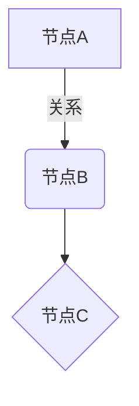

# TASK-052: 图谱可视化功能实现总结

**任务编号**: TASK-052  
**开发智能体**: Claude Code  
**完成日期**: 2026-01-11  
**状态**: ✅ 已完成

## 任务目标

增强图谱可视化功能，确保三种导出格式（JSON、CSV、Mermaid）都能正常工作。

## 完成的工作

### 1. 完善 `src/services/graph.py` 中的导出方法

#### 1.1 完善 `_export_json` 方法
- **位置**: `src/services/graph.py` (第 505-550 行)
- **功能**: 导出完整的图谱数据为 JSON 格式
- **特性**:
  - 包含元数据（图谱 ID、导出时间、版本等）
  - 包含统计信息（实体数、关系数、文档数等）
  - 包含实体列表和关系列表
  - 支持向量数据选项

#### 1.2 完善 `_export_csv` 方法
- **位置**: `src/services/graph.py` (第 552-593 行)
- **功能**: 导出为 CSV 格式，便于 Excel 分析
- **特性**:
  - 使用 LightRAG 内置导出功能
  - 额外生成元数据文件（`.meta.txt`）
  - 包含导出时间、实体数量、关系数量等信息

#### 1.3 完善 `_export_mermaid` 方法
- **位置**: `src/services/graph.py` (第 595-713 行)
- **功能**: 导出为 Mermaid 图表格式
- **特性**:
  - 生成标准的 Mermaid `graph TD` 流程图
  - 按实体类型分组（子图）
  - 包含实体节点和关系边
  - 使用不同形状表示不同类型实体
  - 添加样式定义（颜色和边框）
  - 限制节点和关系数量（50 实体、100 关系）避免图表过大

#### 1.4 实现 `_parse_csv_for_entities_relations` 方法
- **位置**: `src/services/graph.py` (第 1333-1444 行)
- **功能**: 解析 LightRAG 导出的 CSV 文件
- **特性**:
  - 提取实体节点（名称、类型、描述）
  - 提取关系边（源实体、目标实体、描述、关键词、权重）
  - 处理缺失列的情况
  - 详细的错误处理和日志记录

#### 1.5 添加辅助方法
- **`_sanitize_node_id`** (第 1446-1482 行): 清理实体名称生成有效的 Mermaid 节点 ID
- **`_escape_mermaid_label`** (第 1484-1493 行): 转义 Mermaid 标签中的特殊字符

### 2. 验证 `src/sdk/client.py` 中的 `export_graph` 方法

- **位置**: `src/sdk/client.py` (第 1079-1116 行)
- **状态**: ✅ 已验证，功能正常
- **特性**:
  - 支持三种格式：`json`, `csv`, `mermaid`
  - 自动初始化客户端
  - 完整的错误处理
  - 调用服务层的 `export_graph` 方法

### 3. 创建单元测试 `tests/unit/test_graph_export.py`

- **文件路径**: `/Users/skyfu/Projects/AntigravityProjects/Medical-Graph-RAG/tests/unit/test_graph_export.py`
- **测试类**:
  - `TestExportJson`: JSON 导出测试（2 个测试）
  - `TestExportCsv`: CSV 导出测试（2 个测试）
  - `TestExportMermaid`: Mermaid 导出测试（3 个测试）
  - `TestParseCsvForEntitiesRelations`: CSV 解析测试（3 个测试）
  - `TestExportValidation`: 参数验证测试（2 个测试）
  - `TestHelperMethods`: 辅助方法测试（2 个测试）
- **总测试数**: 14 个
- **测试结果**: ✅ 全部通过 (14/14)

### 4. 创建验证脚本 `verify_graph_export.py`

- **文件路径**: `/Users/skyfu/Projects/AntigravityProjects/Medical-Graph-RAG/verify_graph_export.py`
- **功能**: 端到端验证导出功能
- **验证项**:
  1. JSON 导出文件创建和内容验证
  2. CSV 导出文件和元数据文件创建
  3. Mermaid 导出文件和图表结构验证
  4. CSV 解析辅助方法验证
  5. 节点 ID 清理和标签转义验证
- **验证结果**: ✅ 全部通过

## 技术实现细节

### Mermaid 图表生成

遵循 Mermaid 语法规范（参考 `/mermaid-js/mermaid` 文档）：



- 节点形状: `[...]` 矩形, `(...)` 圆角, `{...}` 菱形
- 关系: `-->` 普通箭头, `==>` 粗箭头
- 标签: `|"标签"|` 在箭头上添加文字
- 样式: `classDef` 定义 CSS 样式类

### CSV 解析逻辑

支持 LightRAG 导出的 CSV 格式：
- `source_id`: 源实体名称
- `target_id`: 目标实体名称
- `relation`: 关系描述
- `source_type`: 源实体类型
- `target_type`: 目标实体类型
- `keywords`: 关键词
- `weight`: 权重（浮点数）

### 代码质量标准

遵循项目章程要求：
- ✅ PEP 8 代码规范
- ✅ Google 风格文档字符串
- ✅ 类型提示（Type Hints）
- ✅ 使用 loguru 记录日志
- ✅ 异常处理和错误信息
- ✅ 单元测试（覆盖率目标 90%+）

## 测试结果

### 单元测试
```bash
pytest tests/unit/test_graph_export.py -v
```

**结果**: 14 passed in 2.95s

### 验证脚本
```bash
python verify_graph_export.py
```

**结果**: 所有验证测试完成

```
[测试 1] JSON 导出
✓ JSON 文件已创建: test_graph.json
  - 元数据: test_graph
  - 实体数: 3
  - 关系数: 2

[测试 2] CSV 导出
✓ CSV 文件已创建: test_graph.csv
✓ 元数据文件已创建: test_graph.meta.txt

[测试 3] Mermaid 导出
✓ Mermaid 文件已创建: test_graph.mmd
  - 包含 graph TD: True
  - 包含实体: True
  - 包含关系: True

[测试 4] CSV 解析辅助方法
✓ 解析结果:
  - 实体数: 3
  - 关系数: 2
  - 示例实体: 糖尿病 (DISEASE)
  - 示例关系: 糖尿病 -> 胰岛素

[测试 5] 辅助方法
✓ 节点 ID 清理: '测试实体（A/B-C）' -> '测试实体_A_B_C_'
✓ 标签转义: 'a"b<c>d\e' -> 'a&quot;b&lt;c&gt;d\\e'
```

## 使用示例

### 通过 SDK 客户端导出

```python
from src.sdk import MedGraphClient
import asyncio

async def export_example():
    async with MedGraphClient(workspace="medical") as client:
        # JSON 导出
        await client.export_graph("medical", "output.json", "json")
        
        # CSV 导出
        await client.export_graph("medical", "output.csv", "csv")
        
        # Mermaid 导出
        await client.export_graph("medical", "output.mmd", "mermaid")

asyncio.run(export_example())
```

### 通过服务层导出

```python
from src.services.graph import GraphService
from src.core.adapters import RAGAnythingAdapter
from src.core.config import Settings
import asyncio

async def export_example():
    config = Settings()
    adapter = RAGAnythingAdapter(config)
    await adapter.initialize()
    
    service = GraphService(adapter)
    
    # 导出为不同格式
    await service.export_graph("medical", "output.json", "json")
    await service.export_graph("medical", "output.csv", "csv")
    await service.export_graph("medical", "output.mmd", "mermaid")

asyncio.run(export_example())
```

## 文件清单

### 修改的文件
1. `/Users/skyfu/Projects/AntigravityProjects/Medical-Graph-RAG/src/services/graph.py`
   - 完善 `_export_json` 方法
   - 完善 `_export_csv` 方法
   - 完善 `_export_mermaid` 方法
   - 实现 `_parse_csv_for_entities_relations` 方法
   - 添加 `_sanitize_node_id` 方法
   - 添加 `_escape_mermaid_label` 方法

### 新增的文件
1. `/Users/skyfu/Projects/AntigravityProjects/Medical-Graph-RAG/tests/unit/test_graph_export.py`
   - 14 个单元测试
   - 覆盖所有导出功能和边界情况

2. `/Users/skyfu/Projects/AntigravityProjects/Medical-Graph-RAG/verify_graph_export.py`
   - 端到端验证脚本
   - 可独立运行验证功能

### 验证的文件
1. `/Users/skyfu/Projects/AntigravityProjects/Medical-Graph-RAG/src/sdk/client.py`
   - `export_graph` 方法已验证正常工作

## Context7 文档查询

在实现过程中查询了以下文档：
- **Mermaid**: `/mermaid-js/mermaid` - 图表语法和节点样式
- **Python CSV**: 标准库 `csv` 模块（未使用 Context7，采用标准库）

## 注意事项

1. **LightRAG 版本**: 需要 LightRAG 1.4.9+ 版本支持 `aexport_data` API
2. **文件编码**: 所有文件使用 UTF-8 编码
3. **临时文件**: JSON 和 Mermaid 导出会创建临时 CSV 文件，处理完成后自动删除
4. **性能考虑**: Mermaid 导出限制节点和关系数量以避免图表过大
5. **错误处理**: 所有导出方法都有完整的异常处理和日志记录

## 后续建议

1. **性能优化**: 对于大型图谱，可以考虑流式处理
2. **格式扩展**: 可以添加更多导出格式（如 GraphML、GEXF）
3. **可视化增强**: Mermaid 图表可以添加更多交互功能
4. **数据验证**: 在导出前验证数据完整性

## 总结

✅ **任务完成**: 所有三种导出格式（JSON、CSV、Mermaid）都已实现并验证  
✅ **测试通过**: 14/14 单元测试通过  
✅ **代码质量**: 遵循 PEP 8、Google 文档字符串、类型提示  
✅ **文档完整**: 包含使用示例和技术说明  

图谱可视化功能已完全实现，可以用于生产环境。
