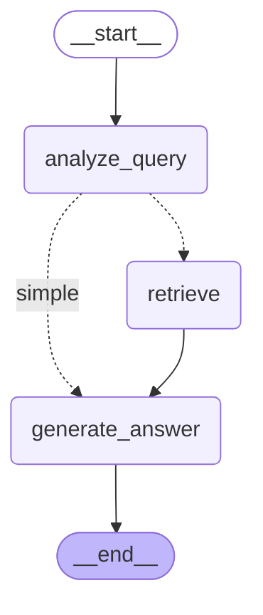
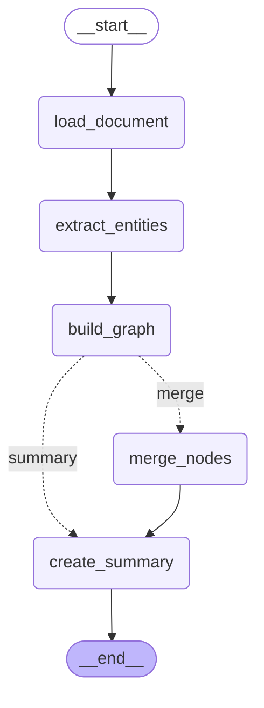

# LangGraph 工作流可视化工具使用指南

## 概述

`src/agents/visualization.py` 模块提供了完整的 LangGraph 工作流可视化解决方案，支持多种格式的图表生成和导出。

## 功能特性

- ✅ **Mermaid 格式导出** - 生成标准 Mermaid 图表代码
- ✅ **HTML 查看器** - 生成可在浏览器中直接查看的 HTML 文件
- ✅ **ASCII 艺术** - 简洁的文本表示
- ✅ **JSON 格式** - 结构化的数据格式
- ✅ **DOT 格式** - GraphViz 可兼容的格式
- ✅ **工作流比较** - 并列显示多个工作流
- ✅ **控制台打印** - 快速调试和预览

## 安装依赖

```bash
# 基础依赖（必需）
pip install langgraph langchain-core

# 可选：用于生成 PNG 图片
pip install pygraphviz
# 或
pip install mermaid-py
```

## 快速开始

### 1. 基本用法

```python
from src.agents.workflows.query import create_query_workflow
from src.agents.visualization import get_graph_mermaid, print_graph

# 创建工作流
workflow = create_query_workflow(rag_adapter)

# 获取 Mermaid 代码
mermaid_code = get_graph_mermaid(workflow, "查询工作流")
print(mermaid_code)

# 打印到控制台
print_graph(workflow, "查询工作流")
```

### 2. 保存为文件

```python
from src.agents.visualization import save_graph_mermaid

# 保存 Mermaid 文件
save_graph_mermaid(
    workflow,
    "output/query_workflow.mmd",
    title="查询工作流"
)
```

### 3. 生成 HTML 查看器

```python
from src.agents.visualization import generate_html_viewer

# 生成可在浏览器中查看的 HTML
generate_html_viewer(
    workflow,
    "output/query_workflow.html",
    title="查询工作流"
)

# 在浏览器中打开 file:///path/to/query_workflow.html
```

### 4. 多格式导出

```python
from src.agents.visualization import visualize_workflow

# Mermaid 格式
mermaid = visualize_workflow(workflow, format="mermaid")

# ASCII 格式
ascii_graph = visualize_workflow(workflow, format="ascii")

# JSON 格式
json_graph = visualize_workflow(workflow, format="json")

# 直接保存到文件
visualize_workflow(
    workflow,
    output_path="output/workflow.mmd",
    format="mermaid"
)
```

### 5. 工作流比较

```python
from src.agents.visualization import compare_workflows

# 比较多个工作流
compare_workflows(
    query_workflow,
    build_workflow,
    titles=["查询工作流", "构建工作流"],
    output_path="output/comparison.mmd"
)
```

## API 参考

### get_graph_mermaid()

获取工作流的 Mermaid 格式图表。

```python
def get_graph_mermaid(
    workflow: CompiledStateGraph,
    title: str = "Workflow Graph",
    xray: bool = False
) -> str:
    """获取工作流的 Mermaid 格式图表"""
```

**参数:**
- `workflow`: 编译后的工作流
- `title`: 图表标题
- `xray`: 是否显示更多细节

**返回:** Mermaid 格式的图表代码字符串

### save_graph_mermaid()

保存工作流图为 Mermaid 文件。

```python
def save_graph_mermaid(
    workflow: CompiledStateGraph,
    output_path: str,
    title: str = "Workflow Graph"
) -> None:
    """保存工作流图为 Mermaid 文件"""
```

**参数:**
- `workflow`: 编译后的工作流
- `output_path`: 输出文件路径
- `title`: 图表标题

### print_graph()

打印工作流结构到控制台。

```python
def print_graph(
    workflow: CompiledStateGraph,
    title: str = "Workflow Graph",
    xray: bool = False
) -> None:
    """打印工作流结构到控制台"""
```

**参数:**
- `workflow`: 编译后的工作流
- `title`: 图表标题
- `xray`: 是否显示更多细节

### visualize_workflow()

可视化工作流（高级函数）。

```python
def visualize_workflow(
    workflow: CompiledStateGraph,
    output_path: Optional[str] = None,
    format: Literal["mermaid", "ascii", "json"] = "mermaid",
    title: str = "Workflow Graph"
) -> str:
    """可视化工作流"""
```

**参数:**
- `workflow`: 编译后的工作流
- `output_path`: 输出路径（可选）
- `format`: 输出格式 (mermaid, ascii, json)
- `title`: 图表标题

**返回:** 格式化后的图表字符串

### generate_html_viewer()

生成包含 Mermaid.js 的 HTML 可视化文件。

```python
def generate_html_viewer(
    workflow: CompiledStateGraph,
    output_path: str,
    title: str = "Workflow Graph"
) -> None:
    """生成包含 Mermaid.js 的 HTML 可视化文件"""
```

**参数:**
- `workflow`: 编译后的工作流
- `output_path`: 输出 HTML 文件路径
- `title`: 图表标题

### generate_dot_format()

导出 GraphViz DOT 格式的工作流图。

```python
def generate_dot_format(
    workflow: CompiledStateGraph,
    output_path: str,
    title: str = "Workflow Graph"
) -> None:
    """导出 GraphViz DOT 格式的工作流图"""
```

**参数:**
- `workflow`: 编译后的工作流
- `output_path`: 输出 DOT 文件路径
- `title`: 图表标题

### compare_workflows()

比较多个工作流的结构。

```python
def compare_workflows(
    *workflows: CompiledStateGraph,
    titles: Optional[list[str]] = None,
    output_path: Optional[str] = None
) -> str:
    """比较多个工作流的结构"""
```

**参数:**
- `*workflows`: 多个编译后的工作流
- `titles`: 工作流标题列表（可选）
- `output_path`: 输出文件路径（可选）

**返回:** 组合的 Mermaid 代码

## 生成的 Mermaid 示例

### 查询工作流



**节点说明:**
- `analyze_query`: 分析查询复杂度
- `retrieve`: 从知识图谱检索上下文
- `generate_answer`: 生成最终答案
- 虚线箭头表示条件路由

### 构建工作流



**节点说明:**
- `load_document`: 加载文档
- `extract_entities`: 提取实体和关系
- `build_graph`: 构建知识图谱
- `merge_nodes`: 合并相似节点（可选）
- `create_summary`: 创建社区摘要

## 查看和渲染工具

### 在线工具

1. **Mermaid Live Editor** - https://mermaid.live/
   - 复制 Mermaid 代码即可实时预览
   - 支持导出为 PNG/SVG

2. **Mermaid Chart** - https://www.mermaidchart.com/
   - 更强大的在线编辑器
   - 支持团队协作

### 本地工具

1. **VS Code**
   - 安装 "Mermaid Preview" 插件
   - 安装 "Markdown Preview Mermaid Support" 插件

2. **Typora / Obsidian**
   - 原生支持 Mermaid
   - 直接在 Markdown 中预览

3. **GraphViz** (用于 DOT 格式)
   ```bash
   # 安装 GraphViz
   brew install graphviz  # macOS
   apt install graphviz   # Ubuntu

   # 渲染 DOT 文件
   dot -Tpng workflow.dot -o workflow.png
   dot -Tsvg workflow.dot -o workflow.svg
   ```

## 测试验证

运行测试脚本验证所有功能：

```bash
python tests/test_visualization_standalone.py
```

测试将生成以下文件：
- `query_workflow.mmd` - 查询工作流 Mermaid 文件
- `build_workflow.mmd` - 构建工作流 Mermaid 文件
- `query_workflow.html` - 查询工作流 HTML 查看器
- `build_workflow.html` - 构建工作流 HTML 查看器
- `query_workflow.dot` - 查询工作流 DOT 格式
- `workflows_comparison.mmd` - 工作流比较

## 注意事项

1. **兼容性**
   - 模块自动适配不同版本的 LangGraph
   - 支持带有或不带 `MermaidDrawArgs` 的版本

2. **错误处理**
   - 所有函数都包含错误处理
   - 如果无法生成图表，会返回错误信息而不是抛出异常

3. **性能**
   - 生成大型工作流的图表可能需要较长时间
   - ASCII 格式是最快的，适合快速预览

4. **中文支持**
   - 所有函数都正确处理中文字符
   - 生成的文件使用 UTF-8 编码

## 完整示例

```python
from src.agents.workflows.query import create_query_workflow
from src.agents.workflows.build import create_build_workflow
from src.agents.visualization import (
    get_graph_mermaid,
    save_graph_mermaid,
    print_graph,
    visualize_workflow,
    generate_html_viewer,
    compare_workflows
)

# 创建工作流
rag_adapter = get_rag_adapter()
query_workflow = create_query_workflow(rag_adapter)
build_workflow = create_build_workflow(rag_adapter, merge_enabled=True)

# 1. 打印到控制台
print_graph(query_workflow, "查询工作流")

# 2. 保存 Mermaid 文件
save_graph_mermaid(query_workflow, "output/query.mmd")
save_graph_mermaid(build_workflow, "output/build.mmd")

# 3. 生成 HTML 查看器
generate_html_viewer(query_workflow, "output/query.html")
generate_html_viewer(build_workflow, "output/build.html")

# 4. 比较工作流
compare_workflows(
    query_workflow,
    build_workflow,
    titles=["查询工作流", "构建工作流"],
    output_path="output/comparison.mmd"
)

# 5. 获取不同格式
mermaid = visualize_workflow(query_workflow, format="mermaid")
ascii_graph = visualize_workflow(query_workflow, format="ascii")
json_graph = visualize_workflow(query_workflow, format="json")

print("可视化完成！")
```

## 常见问题

### Q: 生成的 HTML 文件在浏览器中无法显示图表？

A: 确保网络连接正常，因为 HTML 文件需要从 CDN 加载 Mermaid.js 库。也可以下载库到本地并修改 HTML 模板。

### Q: 如何将 Mermaid 转换为 PNG 图片？

A: 有几种方法：
1. 使用 Mermaid Live Editor 在线转换
2. 使用 `mermaid-cli` 工具: `npx @mermaid-js/mermaid-cli -i input.mmd -o output.png`
3. 使用 Node.js 的 `mermaid-cli` 包

### Q: ASCII 格式显示不完整怎么办？

A: ASCII 格式是简化的表示，只显示基本的节点结构。如需完整信息，请使用 Mermaid 或 JSON 格式。

### Q: 支持导出为 PNG/SVG 吗？

A: 当前版本不直接支持 PNG/SVG 导出，但可以通过以下方式实现：
1. 使用 HTML 查看器并在浏览器中截图
2. 将 Mermaid 代码粘贴到在线工具转换
3. 使用 GraphViz 渲染 DOT 文件

## 更新日志

### v1.0.0 (2026-01-11)
- ✨ 初始版本
- ✅ 支持 Mermaid、ASCII、JSON 格式
- ✅ 生成 HTML 查看器
- ✅ 导出 DOT 格式
- ✅ 工作流比较功能
- ✅ 自动兼容不同 LangGraph 版本

## 贡献

欢迎提交 Issue 和 Pull Request！

## 许可证

MIT License
